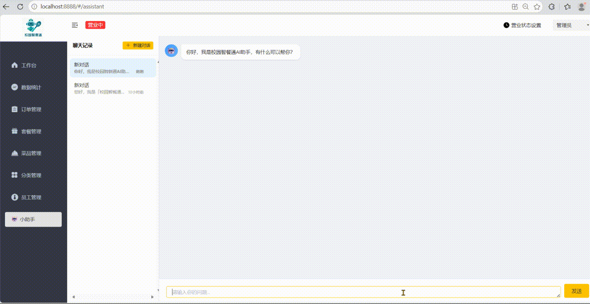

# 校园智餐通管理平台（AI增强版）

> 基于 Spring Boot + Vue 的校园外卖管理系统，集成 AI 智能助手，支持自然语言交互、数据查询与运营分析。

---

## 核心功能亮点

### AI 智能助手
- **自然语言交互**：通过对话方式完成业务操作，无需记忆复杂菜单路径
- **智能数据查询**：支持用自然语言查询订单、营业额、用户等数据，AI 自动解析意图并返回结果
- **运营分析报告**：AI 可生成营业额趋势、热销菜品、订单分布等分析报告，辅助经营决策
- **上下文理解**：支持多轮对话，AI 能理解上下文语境，提供连贯的交互体验

### 后台管理功能
- **员工管理**：员工账号的增删改查、权限分配
- **分类管理**：菜品分类与套餐分类管理
- **菜品管理**：菜品信息维护、启售/停售、口味管理
- **套餐管理**：套餐创建与编辑、套餐内菜品管理
- **订单管理**：订单查询、状态变更、订单详情
- **数据统计**：营业额统计、订单统计、用户统计、销量排名

---

## 演示效果

### AI 智能助手演示



> 通过自然语言与 AI 助手交互，实现订单查询、营业额分析、数据统计等功能。AI 自动理解用户意图，返回结构化的查询结果与分析报告。

---

## 技术栈

### 后端技术
| 技术 | 说明 |
|------|------|
| Spring Boot | 基础框架 |
| MyBatis | ORM 框架 |
| MySQL | 数据库 |
| Redis | 缓存 |
| JWT | 身份认证 |
| Knife4j | API 文档 |
| AI 大模型 | 智能助手核心能力 |

### 前端技术
| 技术 | 说明 |
|------|------|
| Vue 2 | 前端框架 |
| TypeScript | 类型系统 |
| Element UI | UI 组件库 |
| Vuex | 状态管理 |
| Vue Router | 路由管理 |
| Axios | HTTP 请求 |
| ECharts | 数据可视化 |
| SCSS | 样式预处理 |

---

## 项目结构

```
sky-take-out-ai-edition-master/
├── sky-take-out/                    # 后端项目
│   ├── sky-common/                  # 公共模块（工具类、常量、异常）
│   ├── sky-pojo/                    # 实体类模块（DTO、VO、Entity）
│   └── sky-server/                  # 核心服务模块
│       └── src/main/java/com/sky/
│           ├── config/              # 配置类
│           ├── controller/          # 控制器
│           │   ├── admin/           # 管理端接口
│           │   └── user/            # 用户端接口
│           ├── service/             # 业务逻辑层
│           ├── mapper/              # 数据访问层
│           └── annotation/          # 自定义注解
├── project-sky-admin-vue-ts/        # 前端项目
│   └── src/
│       ├── api/                     # 接口定义
│       ├── views/                   # 页面组件
│       │   ├── assistant/           # AI 助手页面
│       │   ├── dashboard/           # 数据看板
│       │   ├── order/               # 订单管理
│       │   ├── dish/                # 菜品管理
│       │   └── employee/            # 员工管理
│       ├── layout/                  # 布局组件
│       ├── store/                   # Vuex 状态管理
│       ├── router/                  # 路由配置
│       └── styles/                  # 全局样式
└── docs/                            # 文档资源
    └── assets/                      # 静态资源
        └── ai-demo.gif              # AI 功能演示
```

---

## 部署说明

### 环境要求
- JDK 8+
- Maven 3.6+
- MySQL 5.7+
- Redis 5.0+
- Node.js 12+（前端开发）

### 后端部署
1. 创建数据库并导入 SQL 脚本
2. 修改数据库连接配置（`application.yml`）
3. 配置 Redis 连接信息
4. 配置 AI 模型 API Key
5. 执行 `mvn clean package` 构建项目
6. 运行 `java -jar sky-server.jar` 启动服务

### 前端部署
1. 进入 `project-sky-admin-vue-ts` 目录
2. 执行 `npm install` 安装依赖
3. 开发环境执行 `npm run serve`
4. 生产环境执行 `npm run build`，将 `dist` 目录部署到 Nginx

---

## 作者信息

| 项目 | 信息 |
|------|------|
| 作者 | CwyOne |
| 邮箱 | 1912187430@qq.com |
| 项目 | 校园智餐通管理平台（AI增强版） |

---

## 开源协议

本项目仅供学习交流使用。
